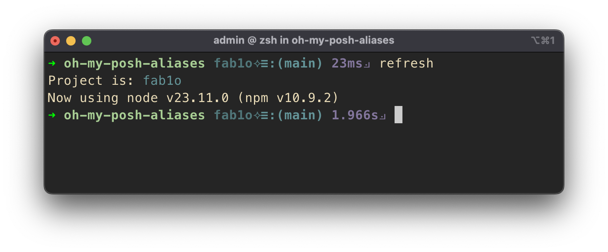
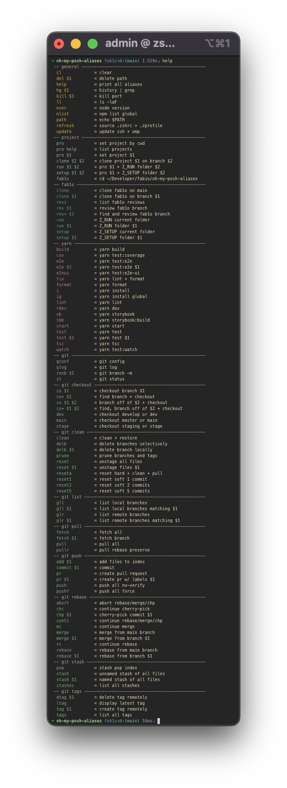

# @fab1o/oh-my-posh-aliases



This repository contains:
- Oh My Posh Theme
- Oh My Zch Aliases and Functions

This theme is loosely based on [robbyrussell](https://ohmyposh.dev/docs/themes#robbyrussell) oh-my-posh's theme and a configurable set of aliases and functions to pump your Z (zsh) shell. This theme fixes an [issue](https://github.com/JanDeDobbeleer/oh-my-posh/issues/6204) with the robbyrussell's theme where the "✗" was incorrectly configured in the oh-my-posh version of robbyrussell's [original](https://github.com/ohmyzsh/ohmyzsh/blob/master/themes/robbyrussell.zsh-theme#L6) Oh My Zsh's theme.

### Oh My Posh Theme

Source here: [fab1o.omp.json](src/fab1o.omp.json). Follow the Setup process below.

### Aliases + Functions

The Aliases and Functions can be used with Oh My Zch only, or in combination with Oh My Posh.

Source here: [.zfab1o](src/.zfab1o) and [.zfab1ocfg](src/.zfab1ocfg). Follow the Setup process below.

### Requirements

- (required) [iTerm2](https://iterm2.com/)
- (required) [oh-my-zsh](https://ohmyz.sh/)
- (recommended) [oh-my-posh](https://ohmyposh.dev/) with [Nerd Fonts](https://ohmyposh.dev/docs/installation/fonts)
- (recommended) [gum](https://github.com/charmbracelet/gum) for better user experience.
- (optional) [Gruvbox](https://github.com/herrbischoff/iterm2-gruvbox) palette, you can edit the colors however.

## Setup

1. Download the [release](https://github.com/fab1o/oh-my-posh-aliases/releases) add the files from the `src` folder to your home folder:
  - .zfab1o
  - .zfab1ocfg
  - fab1o.omp.json

2. Add this to your `~/.zshrc`:

```sh
source "$HOME/.zfab1o"
eval "$(oh-my-posh init zsh --config ~/fab1o.omp.json)"
```

3. Edit your `~/.zfab1ocfg` file.

## Complete Setup

Documentation [here](docs/setup.md).

## Upgrade

Considering upgrading if the version in your `.zfab1o` is outdated.

## Help

Type `help`:



